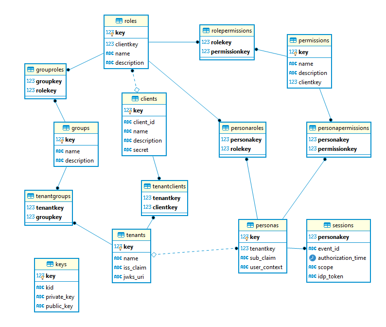

# The Usher

## Entity Relationship Diagram



## Contributing to The Usher

### OpenAPI Spec (API-first development)

The APIs are described in the [OpenAPI Spec](./the-usher/the-usher-openapi-spec.yaml) ([raw](https://raw.githubusercontent.com/DMGT-TECH/the-usher/master/the-usher/the-usher-openapi-spec.yaml?token=AALUXXMVKHC3FXRRUTQGPIS6NAMJQ)).  The spec file describes the mappings from API endpoints to the implementing controllers and methods:

- `x-swagger-router-controller` refers to the controller file located in `./server/src/api_endpoints/`
- `operationId` refers to the function within the controller file implementing the endpoint

For example, here is how the `/self/token` endpoint is defined and mapped:

```yaml
  /self/token:
    post:
      'x-swagger-router-controller': 'endpoint_self_token'
      operationId: issueSelfToken  #  https://tools.ietf.org/html/rfc7523#section-2.1
      summary: Issue an access token (JWT) containing permissions for the logged-in persona to cover the requested scope.
      ...
```

The OpenAPI spec also specifies what kind of security is required to access each endpoint. (That is, whether the endpoint requires a token and what type -- e.g., a client persona token, a client admin token, or a The Usher admin token.)

### API Conventions

A good API design follows common best practices and consistency which makes the job of using the API for the developer much easier and straight forward. The following list is an agreed to set of best practices we are following with The Usher API.

- Accept and respond with JSON
- Use nouns instead of verbs in endpoint paths (prefer to rely on HTTP verbs to convey the action)
- Name collections with plural nouns
- Nesting resources for hierarchical objects
- Handle errors gracefully and return standard error codes
  - TODO: Agree on error code (for security perspective) for user requesting access to resource that exists but doesn't have access to. 401, 403, 404
- TODO: Agree on PUT vs. PATCH for updates
  - PATCH API methods should return HTTP 201 success with an empty response body.
  - PUT API methods should return HTTP 200 success with a full object in response, same as returned for POST.
- APIs that create new objects, via a `POST` should return an HTTP 201 with a response of the newly created object.
- API responses that contain a list of objects should be wrapped in a `data` attribute. For example: `GET /roles`

  ```json
  {
    "data": [
      {
        "attribute1": "value1",
        "attribute2": "value2"
      }
    ]
  }
  ```

- TODO: pagination, sorting

### Database Setup

The application requires access to a PostgreSQL database. You may run a database instance locally, use a docker container which hosts an instance, or connect to our cloud test instance. The preferred set up for local development is to use the included database as part of the docker-compose set up.

**Step 1**.  Create or connect to the database server, using one of the following 3 options:

- *1A. Local Instance*. Install PostgreSQL locally.
- *1B. Docker Instance*.  Launch with the included [docker compose](https://docs.docker.com/compose/gettingstarted/) file.
- *1C. Cloud Test Instance.*  Obtain the database hostname, username, password and pass in via the `.env` file or environment variables.

See the full database set up and usage instructions in the [database README](../../database).

### Development Environment Setup Using docker-compose

To start a ready to go development environment, issue the following command `docker-compose up` in the root directory of the project. This command fires up *docker-compose* which runs 2 instances:

1. Postgres database
2. The Usher server

The entrypoint of server is set to run the following script `./scripts/run_for_development.sh` which prepares a database for development and runs a The Usher server in inspect mode.
When Usher server is running, the following ports will be exposed:

1. **5432** - Postgres server
2. **3001** - Usher server
3. **9229** - Inspector. You may attach your debugger to this port

To exit the process you may use `ctrl-c` or run `docker-compose down`.

### Run new database migration / seed / reset db

If you are using `docker-compose` stack for your development, you can migrate your database to the latest by restarting `usher-server` docker container. Or you might `ssh` connect to your container and run the commands manually.

#### Useful commands

1. `docker ps`: To see all the running containers. Use `-a` flag to see all.
1. `docker restart [Container Id]`: To restart a docker container.
1. `docker exec -it [usher-server Container Id] bash`: To `ssh` connect inside your container. You can find the project at `/app` inside the container.

## Publish New Version

The following is the process for publishing a new version of The Usher. The process includes creating a new Release within GitHub and publishing new package versions.

1. Update the package version by incrementing the value of the `version` key in the `package.json` file within both the database and server folders.
1. Run an `npm install` to ensure each associated `package-lock.json` file is updated with the updated value.
1. Commit and push the above changes that contain the new version numbers to master branch.
1. Create a [new release](https://github.com/DMGT-TECH/the-usher/releases/new), for the Tag Version and Release title use a format of vX.Y.Z, ie. v1.2.0 . In the Description field, describe what was changed in the release with headers for "Features & Updates" and "Library & Security Updates".
1. After the new GitHub release has been created, this will trigger a [GitHub Action](https://github.com/DMGT-TECH/the-usher/actions?query=workflow%3A%22Publish+npm+package%22) to automatically publish the two new packages to GitHub.
