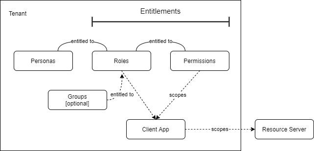

# The Usher

## Concepts and Glossary of Terms

- **User**: An individual, belonging to an organization, and identified by a unique subscriber ID. This ID could be provided by an ID provider like Auth0 or Salesforce, or be a natural ID like email address. Users use User Agents (like browsers) to access client applications.
- **User Context**: The account context for a specific User. A User can have different accounts but be identified using the same subscriber ID. This allows the User to be identified in the context of the account in which they are operating.
- **Tenant**: An organization identified by a unique issuer ID. Client Applications can be set up independently to separate different organizations (single tenant). Also, multiple organisations can use the same Client Application and are differentiated by an identifier on access (mutli-tenant). The Tenant in The Usher identifies individual organizations either by name or by their issuer claim.
- **Persona**: The manifestation of a user on tenant.This has a very specific meaning in the context of The Usher. It is possible for a User to have access to Client Applications on different Tenants using the same sub_claim (for example their email address). The Usher allows for this by creating unique Personas linked to a tenant.
- **Client** (Client Application): An application for which personas can be assigned entitlements. The client application may change its behavior based on the scope granted to it by a Resource Authorization Server. For example, the client may use the granted roles to determine what kind of UI to presented to the persona, and the client may receive different or limited responses from backends/APIs based on the granted permissions. Various contexts of an application may only require and request particular limited scope.
- **Entitlement**: A role or a permission that is assigned to a persona (to which a persona is `entitled`).
- **Group**: A tag applied to users and managed on the customer identity server. These tags can be carried in the ID/access token under the claim `groups` An organization's groups can be mapped to Application Roles by this Resource Authorization Server.
- **Role** (Application Role): Application-specific collection of permissions (they expand into permissions). Roles may be enumerated as part of SKUs stored in a CRM like Salesforce. The same Role can be allocated in multiple applications (i.e., with the same name).
- **Permission**: Describes actions that the persona or client can be authorized to perform on particular kinds of resources. Defining roles and permissions is complex and should be carefully considered against the requirements of your use cases. Our recommendation is that these are name-spaced, for example `noun:verb` or finer grained `category:noun:verb`.
- **Scope**: (Sub)set of entitlements that client applications can request from the Resource Authorization Server and that are granted (authorized) for a particular context (client application X persona X etc).
- **User Authorization Server** (Identity Server): A service the user uses to identify themselves. Returns an identity token and possible an access token to the client. The act of the user logging through the client application means the user grants access of the application to the necessary entitled resources. We do not need to prompt the user for further authorization. (The client application and back-end resources are both owned by the opco).
- **Resource Authorization Server**: A service that provides APIs to retrieve granted entitlements from an efficient cache.</b> Validates an identity/access token on each request. It returns a list of these granted entitlements or a signed token if that is requested by the client application (e.g., for use with publicly accessible Resource Servers).
- **Resource Server**: A back-end API or service used by a client application or used directly by a persona. (''Direct'' use is typically via an API gateway; the gateway is considered to be a lightweight client application).
